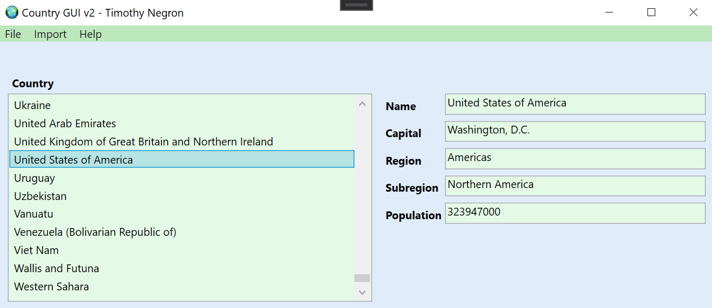
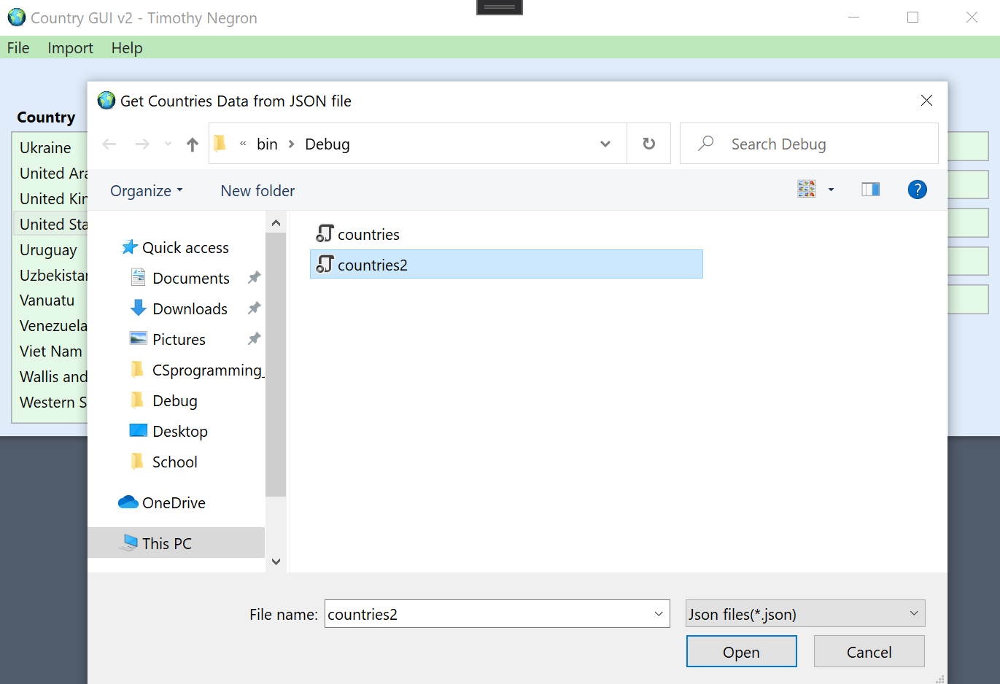
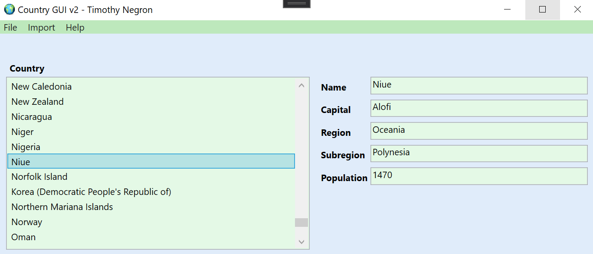
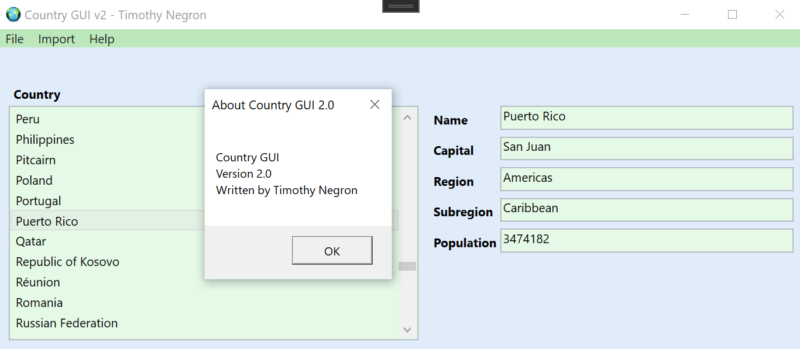

# country-db-interface

### About

Upon start the program reads a JSON file that contains data related to countries. The data in the files gets stored in memory via a DLL I created with object definitions related to countries. The data is then inserted into a SQL database and then populated on to a list box. When the user selects a item on the list box, the textboxes to the right are populated with data associated with that item.

### Built With

* [C#](https://docs.microsoft.com/en-us/dotnet/csharp/)
* [XAML](https://docs.microsoft.com/en-us/dotnet/desktop/wpf/fundamentals/xaml?view=netdesktop-5.0)
* [WPF](https://docs.microsoft.com/en-us/dotnet/desktop/wpf/introduction-to-wpf?view=netframeworkdesktop-4.8#program-with-wpf)
* [DLL](https://docs.microsoft.com/en-us/windows/win32/dlls/about-dynamic-link-libraries)
* [SQL Server](https://docs.microsoft.com/en-us/sql/database-engine/configure-windows/sql-server-express-localdb?view=sql-server-ver15)
* [ListBox](https://docs.microsoft.com/en-us/dotnet/api/system.windows.forms.listbox?view=net-5.0)
* [OpenFileDialog](https://docs.microsoft.com/en-us/dotnet/api/system.windows.forms.openfiledialog?view=net-5.0)

### Images

